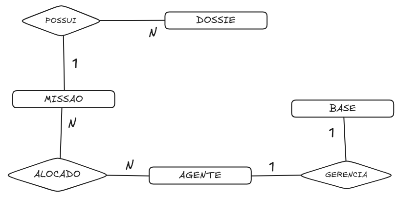

# Avaliação N2 - banco de dados de uma agência de inteligência

Nesta avaliação você vai modelar e implementar, do zero, o banco de uma agência de
inteligência. Diferente da atividade da empresa, aqui o código SQL não vem pronto:
você recebe o cenário e o DER (logo abaixo) e escreve o SQL por conta própria.

O banco se chama `agencia` e guarda quem são os agentes, em quais bases eles ficam,
quais missões existem e os dossiês que cada missão produz.

## Como entregar

- Um arquivo `.sql` com a criação do banco, das tabelas e dos dados de exemplo.
- As consultas pedidas no fim deste documento, também em `.sql`.
- Um texto curto (o levantamento de requisitos) explicando as entidades que você
  identificou e justificando cada uma das três relações.

Leia o DER antes de começar. Ele mostra as mesmas regras descritas aqui, só que em
forma de diagrama.

Para ler o diagrama, olhe os números nas pontas de cada ligação: o lado com `1` entra
uma vez, o lado com `N` entra muitas. Uma MISSAO tem `N` DOSSIE (losango POSSUI): é o
um-pra-muitos. Um AGENTE atua em `N` MISSAO e uma MISSAO tem `N` AGENTE (losango
ALOCADO): é o muitos-pra-muitos. Um AGENTE chefia `1` BASE e uma BASE tem `1` AGENTE no
comando (losango GERENCIA): é o um-pra-um.

## O cenário

A Agência opera com agentes espalhados pelo mundo. Cada agente tem um nome real, que
quase ninguém conhece, e um codinome, que é como ele aparece nos registros. Agentes
entram e saem de operação, então a Agência precisa saber quem está ativo e quem foi
afastado.

Os agentes trabalham a partir de bases operacionais: casas, escritórios de fachada,
prédios sem placa. Cada base tem um agente no comando, o chefe da base. E ninguém
comanda duas bases ao mesmo tempo: um chefe, uma base.

O trabalho de verdade acontece nas missões. Uma missão é uma operação com objetivo
próprio, e a Agência aloca vários agentes nela. Um mesmo agente também costuma estar
em mais de uma missão ao mesmo tempo, porque pessoal bom é escasso.

De cada missão saem dossiês: relatórios de campo, fotos, transcrições. Um dossiê
sempre pertence a uma missão específica, e uma missão acumula vários dossiês ao longo
do tempo.

## O que o sistema precisa guardar

São quatro coisas para guardar e três regras ligando elas:

1. Uma missão produz muitos dossiês, e cada dossiê pertence a uma missão só.
2. Muitos agentes atuam em muitas missões (e um agente pode estar em várias missões
   ao mesmo tempo).
3. Um agente chefia uma base, e cada base tem um chefe só.

Essas três regras são o coração da avaliação. Antes de escrever qualquer comando,
identifique no cenário acima onde cada uma delas aparece.

## Levantamento de requisitos

Abaixo está o que cada tabela precisa guardar. Os tipos e as restrições estão
descritos em palavras; cabe a você traduzir isso para SQL.

### Agente

Guarda quem são as pessoas da Agência.

- **id**: identificador, chave primária, gerado automaticamente.
- **nome_real**: texto, obrigatório.
- **codinome**: texto, obrigatório e único (dois agentes não podem ter o mesmo
  codinome).
- **matricula**: texto, obrigatório e único (é o registro interno da pessoa).
- **ativo**: verdadeiro ou falso, com valor padrão verdadeiro (quem entra na base já
  começa ativo).

### Base operacional

Guarda os pontos físicos de operação. É aqui que mora a relação 1:1.

- **id**: chave primária, automática.
- **nome**: texto, obrigatório.
- **id_chefe**: aponta para um agente. Essa coluna é única, e é esse "único" que
  trava o 1:1: o mesmo agente não pode aparecer como chefe de duas bases. Se o agente
  que chefia for apagado, a base não some junto, só fica sem chefe.

### Missão

Guarda as operações.

- **id**: chave primária, automática.
- **nome**: texto, obrigatório.
- **descricao**: texto longo, opcional.

### Alocação de agente em missão

É a tabela do meio, que existe só para ligar agente e missão. Aqui mora o N:N.

- **id**: chave primária, automática.
- **id_agente**: aponta para um agente.
- **id_missao**: aponta para uma missão.
- O par (id_agente, id_missao) é único, para não registrar a mesma pessoa duas vezes
  na mesma missão. Se o agente ou a missão for apagado, a linha de alocação some junto.

### Dossiê

Guarda os relatórios. Aqui mora o 1:N.

- **id**: chave primária, automática.
- **titulo**: texto, obrigatório.
- **conteudo**: texto longo, opcional.
- **id_missao**: aponta para a missão dona do dossiê. Repare que a chave estrangeira
  fica aqui, no dossiê, que é o lado "muitos". Se a missão for apagada, os dossiês dela
  somem junto.

## As três relações

Cada tipo de ligação tem um jeito conhecido de resolver. Saber qual é qual é metade
da avaliação.

- **Um pra muitos (1:N)**: a chave estrangeira fica na tabela do lado "muitos". Como
  cada dossiê é de uma missão só, é o dossiê que guarda o `id_missao`.
- **Muitos pra muitos (N:N)**: não dá para ligar duas tabelas direto. Cria-se uma
  terceira tabela no meio só para guardar os pares de ids. É a alocação de agente em
  missão.
- **Um pra um (1:1)**: parecido com o 1:N, mas com um "único" na chave estrangeira
  para travar em "só um". É o `id_chefe` da base.

## Material de apoio (banco escola)

Antes desta avaliação você viu cinco arquivos SQL do banco `escola`. Eles são exemplos
de sintaxe, não a resposta daqui: o cenário é outro (escola, não agência). Use-os para
lembrar como se escreve cada comando e adapte para as tabelas da agência.

| Arquivo | O que ensina | Onde usar na avaliação |
|---|---|---|
| `0001 - BASE_DE_DADOS.sql` | `CREATE`, `USE` e `DROP DATABASE` | criar o banco `agencia` e entrar nele |
| `0002 - RESTRICAO_MODIFICADOR.sql` | `PRIMARY KEY`, `AUTO_INCREMENT`, `NOT NULL`, `DEFAULT`, `UNIQUE`, `CHECK`, `FOREIGN KEY`, chave composta | as restrições das colunas e, principalmente, o `UNIQUE` do chefe e o par único da alocação |
| `0003 - TABELAS.sql` | `CREATE`, `RENAME`, `DROP` e `TRUNCATE TABLE` | criar as cinco tabelas (e apagá-las na ordem certa ao recriar) |
| `0004 - COLUNAS-TABELA.sql` | `ALTER TABLE` (`ADD`, `MODIFY`, `RENAME COLUMN`, `CHANGE`, `DROP COLUMN`) | ajustar alguma coluna depois de criada, se precisar |
| `0005 - REGISTROS.sql` | `INSERT`, `UPDATE`, `DELETE` e `SELECT` | inserir os dados de exemplo e conferir o resultado |

## O que você deve entregar

1. **Script de criação**: criar o banco `agencia`, entrar nele e criar as cinco
   tabelas com suas chaves primárias, estrangeiras e restrições. Pense na ordem: uma
   tabela só pode apontar para outra que já existe, então crie primeiro as
   independentes (agente e missão) e depois as que dependem delas.
2. **Dados de exemplo**: insira pelo menos quatro agentes, duas bases, duas missões,
   algumas alocações e alguns dossiês. A ordem da inserção segue as chaves
   estrangeiras: você não consegue dizer que a base tem o chefe 1 antes de o agente 1
   existir. Monte os dados de alocação de um jeito que dê para ver o N:N funcionando:
   um agente em duas missões, uma missão com dois agentes.
3. **Levantamento escrito**: um texto curto identificando as quatro entidades e
   explicando, com suas palavras, por que cada uma das três relações é 1:1, 1:N ou
   N:N. É aqui que você mostra que entendeu, não só que copiou.

## Como você será avaliado

- As cinco tabelas existem, com as chaves e restrições certas (peso maior no `único`
  do chefe, no par único da alocação e nas chaves estrangeiras).
- As três relações estão modeladas no lugar certo: a chave estrangeira do 1:N no lado
  "muitos", a tabela do meio no N:N, o `único` no 1:1.
- Os dados de exemplo respeitam a ordem das chaves estrangeiras e mostram o N:N de pé.

### Dicas

- Se você for recriar o banco várias vezes, apague as tabelas na ordem inversa da
  criação: primeiro as filhas (que apontam para alguém), depois as mães. O banco recusa
  apagar uma mãe enquanto a filha ainda aponta para ela.
